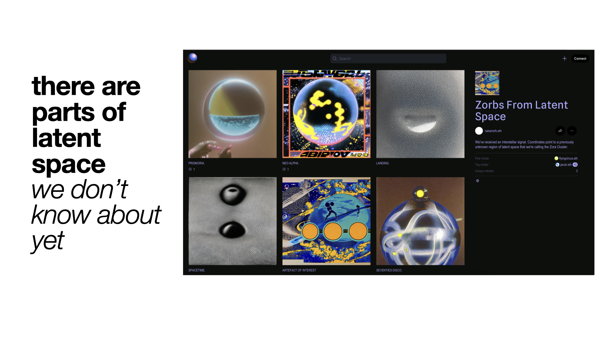
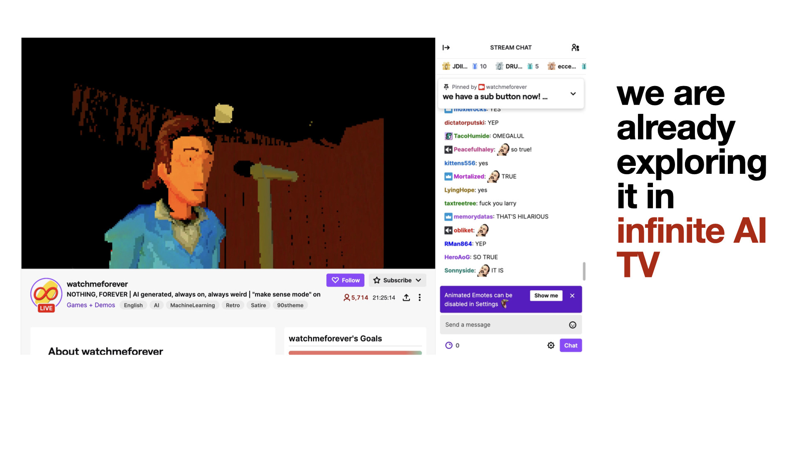
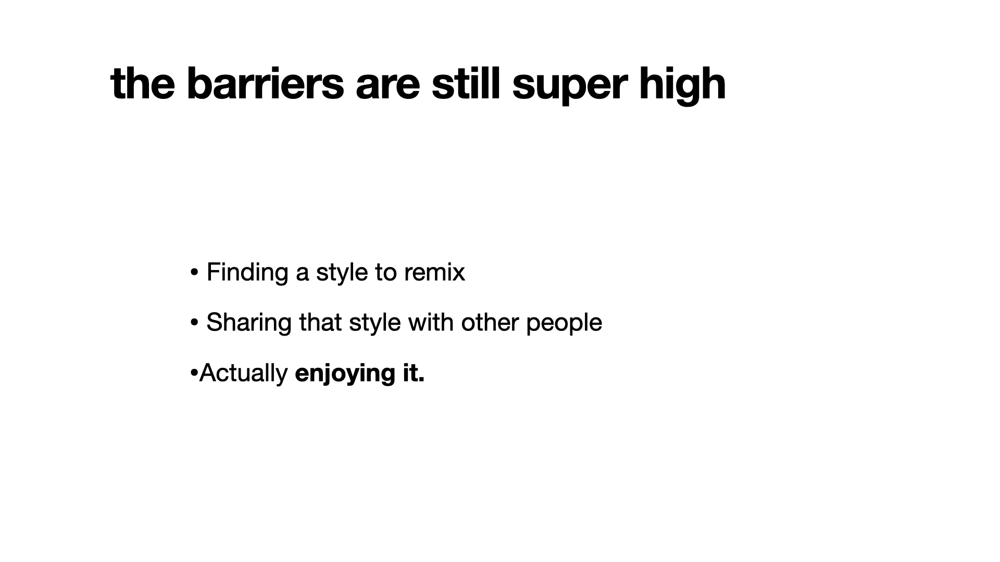
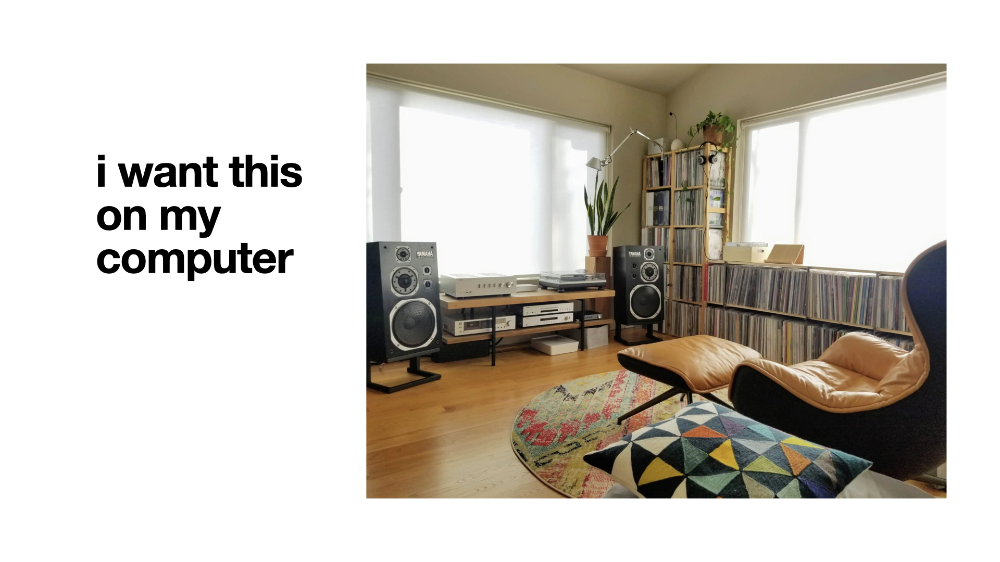

# latent-radio

Built in like ~6hrs (+ a rewrite once from React to Vue).

Autonomous vibe navigation of latent space - generate images, transition them calmly, listen to music.







## Setup.

```sh
npm install
npm run server
```

## Ideas.

https://fastsdxl.ai# vibeexplorer
